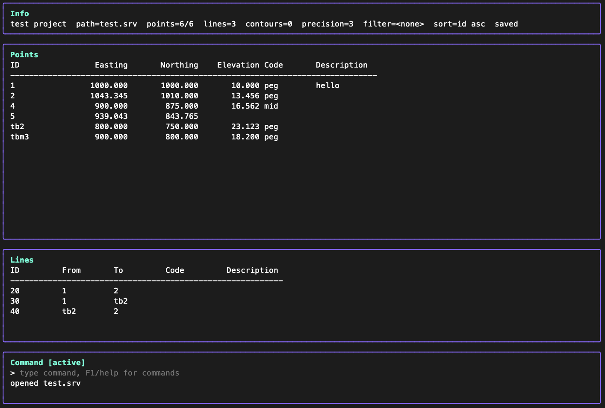

# lsurvey

Plan fieldwork and compute survey geometry without leaving the terminal.
`lsurvey` gives land surveyors a fast, keyboard-driven workspace for managing
points and lines, running everyday COGO commands, checking geometry on an
ASCII map, and exporting clean project data when the job is ready to leave the
screen.

`lsurvey` is a terminal coordinate geometry application for land surveying.
It stores survey projects, manages coded 2D and 3D points, performs common
COGO calculations, shows an ASCII point map, and exports points and lines.



For a full beginner walkthrough that covers the command workflow end to end,
see [TUTORIAL.md](/Users/sumedho/Documents/repos/lsurvey/TUTORIAL.md).

## Features

- Bubble Tea TUI with a command line at the bottom.
- Project save/load using `.srv` files.
- Project description stored with the project and shown in the top info area.
- Coded 2D and 3D points.
- Stored lines with code and description fields.
- Point and line list panels with filtering and sorting.
- Command completion hints and command history.
- Full-screen help with styled sections.
- Full-screen ASCII map with point labels, optional line overlay, pan, zoom,
  and fit-to-points.
- HP calculator style angle input: `dd.mmsshhhh`.
- DMS angle display using degree, minute, second, and hundredth-second symbols.
- Display precision control for coordinates, distances, and elevations.
- CSV point import/export with a strict header.
- ASCII DXF export for points, point labels, and lines.
- Stored contour generation from elevated points and breaklines.

## Requirements

- Go 1.22 or newer.
- A terminal that supports ANSI escape sequences.

## Run

Start a new untitled project:

```sh
go run ./cmd/lsurvey
```

Open an existing project:

```sh
go run ./cmd/lsurvey ./job.srv
```

Build a local binary:

```sh
go build -o lsurvey ./cmd/lsurvey
```

Then run:

```sh
./lsurvey
./lsurvey ./job.srv
```

## Batch Export

Export a saved project to DXF without opening the TUI:

```sh
go run ./cmd/lsurvey export dxf ./job.srv ./job
```

Export a saved project to CSV without opening the TUI:

```sh
go run ./cmd/lsurvey export csv ./job.srv ./points
```

Output extensions are appended when missing:

- Project saves use `.srv`.
- DXF exports use `.dxf`.
- CSV exports use `.csv`.

## TUI Layout

The TUI has four main areas:

- Top info area: project description, file path, dirty state, precision, filter,
  and sort state.
- Point list area: stored points with coordinates, elevation, code, and
  description.
- Line list area: stored lines with endpoints, code, and description.
- Command input area: fixed at the bottom of the screen.

The command line is the main way to work with the project. Type `help` or press
`F1` to open the command reference.

## Keys

- `F1`: open command help.
- `F2`: toggle the ASCII map view.
- `/`: start a point filter command.
- `Tab`: advance the current completion one input at a time. For point IDs
  being created, completion suggests the next unused integer point ID.
- `Ctrl+n` / `Ctrl+p`: cycle command completions.
- `Up` / `Down`: browse previous commands when the command input is empty.
- `Alt+s`: cycle point sort field.
- `Alt+d`: toggle ascending/descending point sort direction.
- `Esc`: close help or map view.
- `Ctrl+C`: quit.

Map keys:

- Arrow keys: pan.
- `+` or `=`: zoom in.
- `-`: zoom out.
- `f`: fit to all points.
- `l`: toggle line overlay.
- `F1`: open help from map view.
- `F2` or `Esc`: return to the main view.

## Project Commands

```text
new <name>
open <file>
save [file]
saveas <file>
desc <project description>
precision <0-6>
units key=value ...
quit
exit
```

Notes:

- `open job` and `open job.srv` both load `job.srv`.
- `save job` writes `job.srv`.
- `saveas revised` writes `revised.srv`.
- `desc Boundary survey Lot 42` updates the description shown in the top bar
  and stores it in the project file.
- `precision 3` displays coordinates, distances, and elevations to three
  decimal places. The default is 3.

## Point Commands

```text
pt add <id> <east> <north> [elev] [code]
pt edit <id> [east=] [north=] [elev=] [code=] [desc=]
pt del <id>
pt rename <old> <new>
pt list
```

Examples:

```text
pt add 1 2000 1000 PEG
pt add 2 2010 1010 52.4 TREE
pt edit 1 code=PEG desc=corner
pt edit 1 desc="front left corner"
pt rename 100 101
pt del 10
pt list
```

Point delete is protected: a point used by a stored line cannot be deleted until
the referencing line is deleted or edited.

Point coordinates are entered and displayed as easting, northing. For commands
that create a point, command completion suggests the next unused integer point
ID.

## Line Commands

```text
line add <id> <p1> <p2> [code]
line edit <id> [from=] [to=] [code=] [desc=]
line del <id>
line list
```

Examples:

```text
line add L1 1 2 BOUNDARY
line edit L1 from=2 to=3 code=EASE desc="access easement"
line del L1
line list
```

Line IDs must be unique. `line add` rejects an existing ID, and `line del`
requires the line to exist.

## Calculation Commands

```text
inverse <from> <to>
angle <back> <vertex> <forward>
rad <from> <azimuth|bearing> <distance> [vdiff <delta>] as <id> [code]
rad3d <from> <azimuth|bearing> <slope_distance> <zenith> as <id> [code]
midpoint <p1> <p2> as <id> [code]
offset <p1> <p2> <offset> <chainage> as <id> [code]
offset <line_id> <offset> <chainage> as <id> [code]
transform fit <src1> <dst1> <src2> <dst2> [<srcN> <dstN> ...]
```

Examples:

```text
inverse 1 2
angle 1 2 3
rad 1 90.0000 10 as 2 CALC
rad 1 N 45.0000 E 50 vdiff 1.2 as 3 PEG
rad3d 1 90.0000 10 90.0000 as 4 SHOT
midpoint 1 2 as 10 MID
offset 1 2 5 25 as 20 OFF
offset L1 5 25 as 20 OFF
transform fit A1 B1 A2 B2 A3 B3
```

`inverse` reports azimuth, horizontal distance, north/east deltas, and 3D
values when both points have elevations.

`angle <back> <vertex> <forward>` reports both the inside and outside angle at
the vertex point.

`rad3d` requires the start point to have an elevation. Zenith angle uses 90° as
horizontal; smaller angles go up and larger angles go down.

Positive offset is calculated to the left of the direction from the first point
to the second point, or from the stored line's `from` point to its `to` point.

`transform fit` calculates a source-to-target similarity transformation without
modifying project data. It reports easting/northing shift (`dx`, `dy`), signed
rotation using the same positive direction as `rotate`, scale, and horizontal
RMS residual. `dz` and vertical RMS use only corresponding pairs where both
points have elevations.

## Intersection Commands

```text
line intersect <a1> <a2> <b1> <b2> as <id> [code]
intersect bearing-bearing <p1> <brg1> <p2> <brg2> as <id> [code]
intersect bearing-distance <p1> <brg> <p2> <dist> choose near|far as <id> [code]
intersect distance-distance <p1> <dist1> <p2> <dist2> choose left|right as <id> [code]
resect <p1> <brg1> <p2> <brg2> <p3> <brg3> as <id> [code]
```

Examples:

```text
line intersect 1 2 3 4 as 5 IP
intersect bearing-bearing 1 45.0000 2 315.0000 as 9 IP
intersect bearing-distance 1 90.0000 2 5 choose far as 3 BD
intersect distance-distance 1 10 2 10 choose left as 3 DD
resect 1 0.0000 2 90.0000 3 270.0000 as 4 RS
```

`resect` bearings are observed from the new unknown point to each known point.
The calculation uses the reverse bearing lines from the known points and stores
a best-fit point from the three lines.

## Traverse Commands

```text
trav start <point>
trav leg <azimuth|bearing> <distance> [vdiff <delta>] [code]
trav show
trav close <known_point>
trav adjust compass|transit
```

Examples:

```text
trav start 1
trav leg 90.0000 25 TRV
trav leg 180.0000 30 vdiff -0.2 TRV
trav show
trav close 99
trav adjust compass
```

Start a traverse from a known point, add legs, close onto a known point, then
apply compass or transit adjustment.

## Contour Commands

```text
contour gen <id> <interval> [base=<elev>] [index=<n>] [breaklines=all|none|ids:L1,L2]
contour list
contour info <id>
contour del <id>
```

Examples:

```text
contour gen C1 1
contour gen C1 0.5
contour gen C1 0.5 base=100 index=5 breaklines=all
contour gen C2 1 breaklines=ids:B1,B2
contour info C1
contour del C1
```

Contours are generated from points that have elevations. Points without
elevations are ignored. At least three elevated, non-collinear points are
required.

When `index=<n>` is omitted, whole-number contour elevations are stored as
major/index contours and intermediate elevations are stored as minor contours.
For example, with interval `0.5`, elevation `18` is major and `18.5` is minor.
Use `index=<n>` to make every nth contour from the base major, or `index=0` to
disable major contours.

Stored project lines can be used as breaklines. By default, `contour gen` uses
all stored lines as breaklines. Use `breaklines=none` to generate contours from
points only, or `breaklines=ids:L1,L2` to use selected lines. Breakline endpoint
points must have elevations, and selected breaklines must not cross except at
shared endpoints.

Generated contours are stored in the `.srv` project. If points or breaklines are
edited later, rerun `contour gen` to replace the contour set.

## TUI Commands

```text
filter <text>
clear filter
sort <id|north|east|elev|code|desc> [asc|desc]
map
map lines
map fit
map zoom in
map zoom out
help
help <command>
```

Examples:

```text
filter PEG
clear filter
sort code
sort north desc
map
map lines
map fit
help rad
```

## Import And Export Commands

```text
import csv <file>
export csv <file>
import geojson <file>
export geojson <file>
export dxf <file>
```

Examples:

```text
import csv points
export csv points
import geojson survey
export geojson survey
export dxf job
```

CSV import is atomic. If any row is invalid, no imported points are applied to
the project.

CSV import/export uses this exact header:

```text
id,easting,northing,elevation,code,description
```

Example CSV:

```csv
id,easting,northing,elevation,code,description
1,2000,1000,52.4,PEG,front left corner
2,2010,1010,,TREE,
```

Elevation may be blank for 2D points.

DXF export writes:

- Point markers.
- Point labels.
- Stored lines in pink.
- Stored contour polylines on `CONTOURS` and `CONTOURS_INDEX` layers.
- Contour elevation labels on `CONTOUR_LABELS` and `CONTOUR_LABELS_INDEX`
  layers, placed at the end of each contour line.

Minor contours use AutoCAD color index 8. Index contours use AutoCAD color
index 1, a heavier DXF lineweight, and a wider polyline width.

## Angle Input

The default angle format is compact HP-style DMS:

- `123.3045` = 123 degrees, 30 minutes, 45 seconds.
- `123.304567` = 123 degrees, 30 minutes, 45.67 seconds.
- `123.30456789` = 123 degrees, 30 minutes, 45.6789 seconds.

Anything after the seconds is interpreted as decimal fractions of a second.
For example, in `dd.mmsshhhh`, `hhhh` is treated as hundredths and further
fractions of a second, not decimal minutes.

Decimal degrees require an explicit suffix:

```text
123.5125d
```

Quadrant bearings are accepted:

```text
N 45.0000 E
S 12.3045 W
```

Angles display as degrees, minutes, seconds, and hundredths of a second, for
example:

```text
90°00′00.00″
```

## Typical Workflow

```text
new Lot 42
desc Boundary survey Lot 42
precision 3
pt add 1 2000 1000 25.500 PEG
pt add 2 2000 1100 25.650 PEG
line add B1 1 2 BOUNDARY
inverse 1 2
rad 1 N 45.0000 E 50 as 3 CALC
angle 2 1 3
offset B1 5 25 as 20 OFF
map lines
save lot42
export dxf lot42
export csv lot42_points
```

## Project Files

Project files are JSON documents with a `.srv` extension. They store:

- Project name and description.
- Unit labels.
- Display precision.
- Points.
- Lines.
- Contour sets.
- Traverse state.
- Command history records.

The file format is intended to remain readable and versioned, but users should
edit projects through `lsurvey` unless they understand the schema.

## Development

Run the full test suite:

```sh
go test ./...
```

Run vet:

```sh
go vet ./...
```

The project uses test-driven development for COGO calculations and command
behavior. Add or update tests when changing calculations, command parsing,
project persistence, import/export, map behavior, or TUI command handling.
